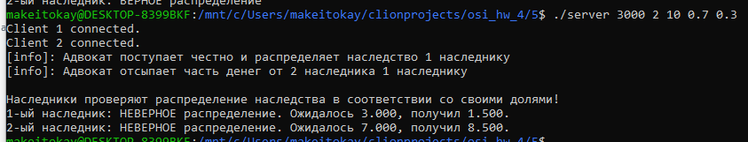
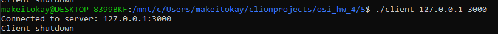
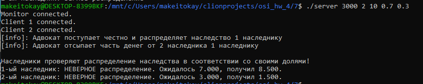
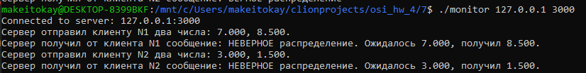
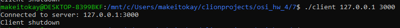

# ИДЗ по ОС №4 / Вариант №24
## Васильев Андрей Михайлович / БПИ215

Работа выполнена с соблюдением всех критериев на **7 БАЛЛОВ**.

## Условие задачи

Задача о наследстве. У старого дона Энрике было два сына, у каждого из сыновей – еще по два сына, каждый из которых имел еще по два сына. Умирая, дон Энрике завещал все свое богатство
правнукам в разных долях. Адвокат дон Хосе выполнил задачу
дележа наследства в меру своих способностей. Правнуки заподозрили адвоката в укрывательстве части наследства или его некорректном перераспределении. Требуется создать приложение,
которое при известных сумме завещания дона Энрике и
доле каждого наследника, проверяет честность адвоката. При решении использовать принцип дихотомии. Примечание.
Необходимо учесть изощренный ум адвоката, который может не
только присваивать себе часть суммы, но и выполнять другие манипуляции с суммой наследства. Но так как наследники знают свою
долю и полученную сумму, они всегда могут вывести адвоката на
чистую воду. Дихотомия подразумевает иерархическое порождение процессов и обратную свертку промежуточных результатов
в единую точку.

## Аргументы командной строки

### Сервер
Первый аргумент - порт, на котором откроется сервер

Второй аргумент - количество клиентов (наследников)

Третий аргумент - сумма наследства

Следующие N аргументов - доли для соответствующего наследника

Пример: 3000 2 10 0.7 0.3

### Клиент и монитор
Первый аргумент - IP адрес сервера

Второй аргумент - порт сервера

## 4-5 баллов

```bash
cd 5
gcc server.c -lrt -lpthread -o server
gcc client.c -lrt -lpthread -o client
./server 3000 2 10 0.3 0.7
```
И отдельно запускаем двух клиентов:
```bash
./client 127.0.0.1 3000
```

Сервер работает следующим образом:
1. Считываются аргументы командной строки
2. Биндится сокет на указанный порт
3. От каждого из клиентов ожидается отправка первоначальных данных для установки соединения
4. Производятся вычисления в соответствии с задачей (см. ИДЗ 2)
5. Каждому из клиентов отправляется два числа: его актуальная сумма наследства и ожидаемая.
6. От клиента получается ответ - вердикт проверки на корректность распределения наследства
7. Сокет закрывается, память освобождается

Клиент работает следующим образом:
1. Отправляются первоначальные серверу по указанному адресу и порту
2. От сервера ожидаются два числа
3. Производится проверка переданных значений
4. Серверу возвращается результат проверки
5. Сокет закрывается




## 6-7 баллов

```bash
cd 7
gcc server.c -lrt -lpthread -o server
gcc client.c -lrt -lpthread -o client
gcc monitor.c -lrt -lpthread -o monitor
./server 3000 2 10 0.3 0.7
```
Первым делом запускаем программу монитор.
```bash
./monitor 127.0.0.1 3000
```
И отдельно запускаем двух клиентов:
```bash
./client 127.0.0.1 3000
```

Реализация монитора осуществлена следующим образом:
1. Сервер перед установкой соединения с клиентами сначала устанавливает соединение с монитором (через отправку первоначальных данных)
2. Монитор при старте устанавливает отправляет серверу первоначальные данные по указанному адресу и порту
3. Сервер после отправки и получения от клиента сообщений отправляет монитору информационное сообщение
4. Монитор получает это сообщение и выводит на экран
5. После того как работа с клиентами окончена, сервер посылает монитору сигнал о завершении работы (сообщение "stop")

В остальном алгоритм работы такой же, как в реализации на 4-5 баллов.





